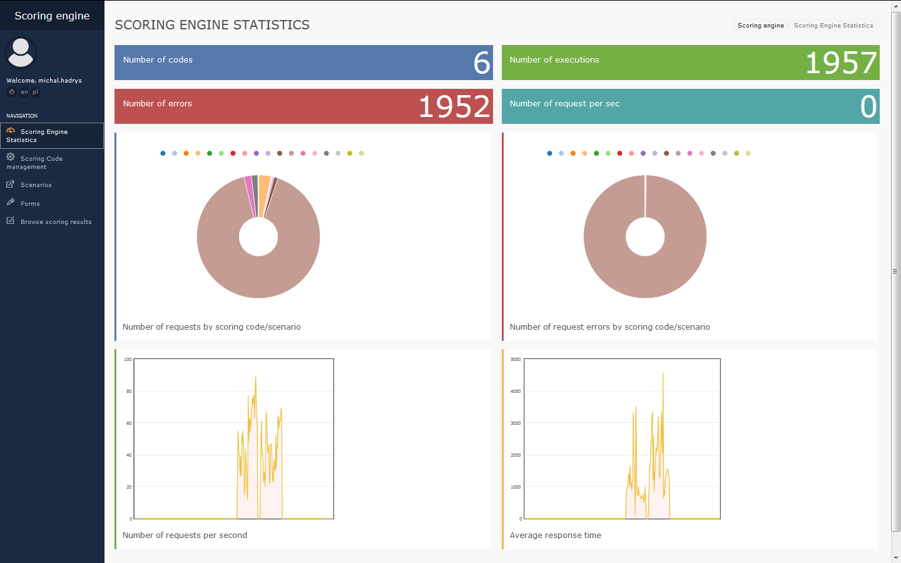
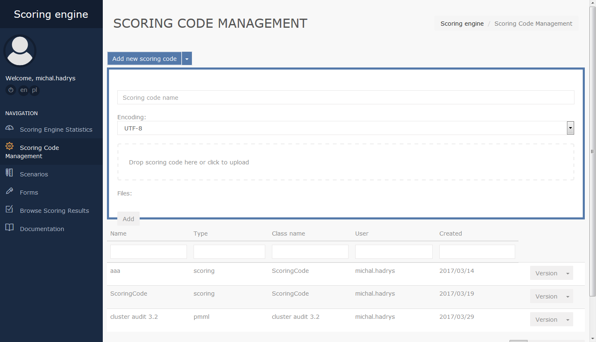
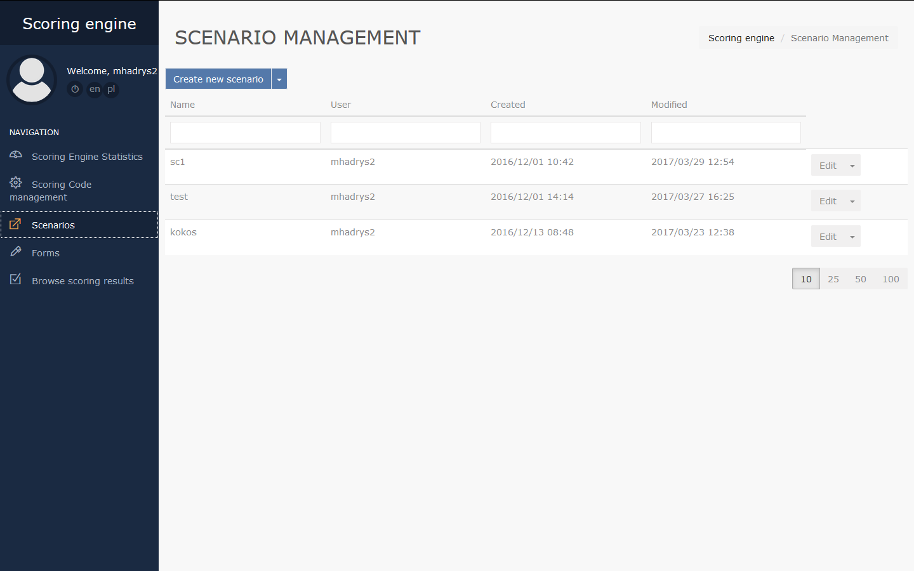
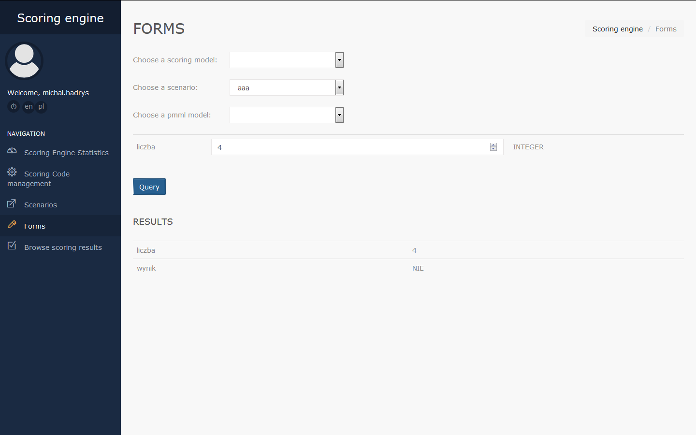
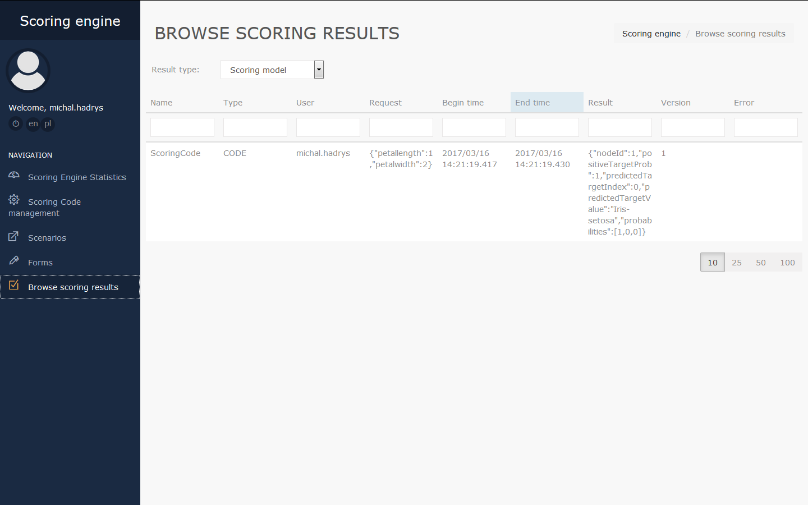

# Panels overview #
Menu on the left side of the screen contains buttons for logging out of the scoring engine and for changing the language, and buttons directing the user to panels.

### Scoring Engine Statistics ###
This panel contains scoring engine statistics. On the top of the panel the following statistics are presented: Number of codes, Number of executions, Number of errors, Number of requests per second. Also, this panel contains pie charts presenting number of requests by scoring code/scenario and number of errors by scoring code/scenario, and column charts presenting number of requests per second and average response time.

### Scoring Code management ###
Scoring Code management panel is designed to add and view scoring codes. It consist of 2 parts: an "Add new scoring code" button, used to add new scoring codes, and a table containing information about added codes. Clicking the Add New Scoring Code button will open an area to add a new code. On the upper side of the area there is a Scoring code name field, in which a name of the code must be entered, and a list od encodings. To choose a file with the code, drag the file to the field on the right side of the area, or click this field and select the file. Added files are shown at the bottom of the area.

The table with information about the codes contains following columns:

- **Name** – code name
- **Type** – code type
- **Class name** – name of the class
- **User** – name of the user, who added the code
- **Created** - date of adding the code

To the right, for every code there is an Version button, and a drop-down list with 3 buttons: Export, Download and  Delete. Version button is used to set the code version, Delete button deletes the code, Export and Download buttons downloads the code in .json or chosen code format respectively. After clicking a code, 2 buttons will appear: Metrics and Scoring Code Src. Metrics button shows code statistics: number of correct and incorrect requests, maximum number of requests per second and maximum, minimum and average response time. Scoring Code Src presents a scoring code.

### Scenarios ###
Scoring Code management panel is designed to add and view scenarios. To add a new scenario, click Create new scenario button, located on top of the panel. Next to the button, there is a drop-down list containing 2 buttons: export and import, that can be used to export or import a scenario. The export button download a JSON file with scenarios data. The import button opens a window, where user must drop a JSON file or click to upload one, and a button to overwrite existing scenarios. Under the Create new scenario button there is a table with information about the scenarios, containing following columns:

- **Name** – scenario name
- **User** – name of the user, who created the scenario
- **Created** – date of scenario creation
- **Modified** – date of last scenario modification

To the right, for every code there is an Edit button, and a drop-down list containing Version, Delete and Copy buttons. Edit button moves the user to editing screen, Version button is used to set the scenario version, Delete button deletes the scenario and Copy button copy the scenario. After clicking a scenario, 2 buttons will appear: Metrics and Scenario Code Src. Metrics button shows scenario statistics: number of correct and incorrect requests, maximum number of requests per second and maximum, minimum and average response time. Scenario Code Src presents a scenario code.

### Forms ###
Forms panel is designed to query scoring/pmml codes and scenarios. The panel contains a drop-down list of scoring models, scenarios and pmml models. After choosing a model/scenario, fields corresponding to model/scenario input variables will appear below. To query a model/scenario, enter values of variables info the proper fields, and click Query button. Results of the query appear below the Query button.

### Browse scoring results ###
This panel is designed to browse results of queries. Results are presented in 3 categories, depending on result type (scoring model results, scenario results, pmml model results). Category can be chosen through a drop-down list, located on top of the panel. For each category the panel contains a table with information about queries, containing following columns:

- **Name** – model/scenario name
- **Type** – model/scenario type
- **User** – name of the user, who created the query
- **Request** – input data of the query
- **Begin time** – start time of query execution
- **End time** – end time of query execution
- **Result** – result of the query
- **Version** – model/scenario version
- **Error** – information about an error (if occurred)

### Documentation ###
Clicking Documentation button in the menu on the left side of the screen open the documentation in new window.